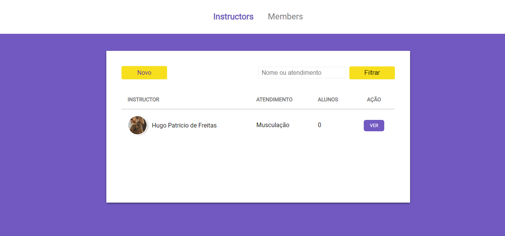
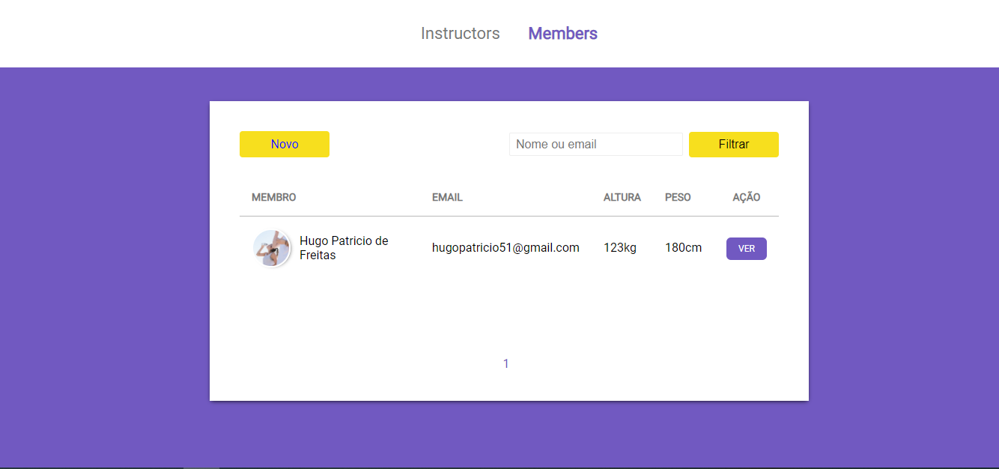

# Gym-Manager

Projeto desenvolvido durante o LaunchBase da RocketSeat!

# Tecnologias utilizadas:
-Express
-Postgres
-Nunjucks

# Instruções

Após clonar o projeto, crie um database no Postgres e edite as informações no arquivo "db.js" dentro de config, coloque as informações de acordo com o banco de dados que estiver em sua máquina.

Após isso abra o terminal dentro do projeto e digite ```nodemon src/server.js``` 

# Imagens do sistema




